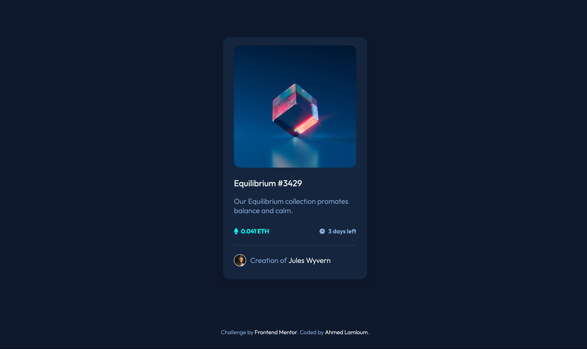

# Frontend Mentor - NFT preview card component solution

This is a solution to the [NFT preview card component challenge on Frontend Mentor](https://www.frontendmentor.io/challenges/nft-preview-card-component-SbdUL_w0U). Frontend Mentor challenges help you improve your coding skills by building realistic projects. 

## Table of contents

- [Overview](#overview)
  - [The challenge](#the-challenge)
  - [Screenshot](#screenshot)
  - [Links](#links)
- [My process](#my-process)
  - [Built with](#built-with)
  - [What I learned](#what-i-learned)
  - [Useful resources](#useful-resources)
- [Author](#author)


## Overview

### The challenge

Users should be able to:

- View the optimal layout depending on their device's screen size
- See hover states for interactive elements

### Screenshot




### Links

- Solution URL: [ solution URL here](https://www.frontendmentor.io/solutions/nft-preview-card-component-main-ERr3azZFo0)
- Live Site URL: [ live site URL here](https://a-lamloum.github.io/nft-preview-card-component-main/)

## My process

### Built with

- Semantic HTML5 markup
- CSS custom properties
- Flexbox

### What I learned

I've had problems dealing with 375px mobile width I cann't make the design perfect as seen in the design image folder. :(

But the good part is I learned how to create a fading overlay effect to an image tutorial [here](https://www.w3schools.com/howto/howto_css_image_overlay.asp)

 see below code example :

```html
<div class="container__img">
              
              <div class="overlay">
                
              </div>
</div>
```
```css
.container__img {
  position: relative;
  width: 100%;
  border-radius: 1rem;
  margin-top: 10px;
  box-sizing: border-box;
}
.overlay {
  position: absolute;
  top: 0;
  bottom: 0;
  left: 0;
  right: 0;
  height: 98.5%;
  width: 100%;
  opacity: 0;
  transition: 0.5s ease;
  background-color: hsla(195, 100%, 36%, 0.4);
  border-radius: 1rem;
}
.container__img:hover .overlay {
  opacity: 1;
  cursor: pointer;
}
.container__img .card__img-overlay {
  width: 30%;
  position: absolute;
  top: 50%;
  left: 50%;
  -webkit-transform: translate(-50%, -50%);
  -ms-transform: translate(-50%, -50%);
  transform: translate(-50%, -50%);
  text-align: center;
}

```

### Useful resources

- [W3School](https://www.w3schools.com/howto/howto_css_image_overlay.asp) - This helped me to apply overlay effect. 

## Author

- Website - [Ahmed Lamloum](https://a-lamloum.github.io/react-portfolio/)
- Frontend Mentor - [@a-lamloum](https://www.frontendmentor.io/profile/a-lamloum)

